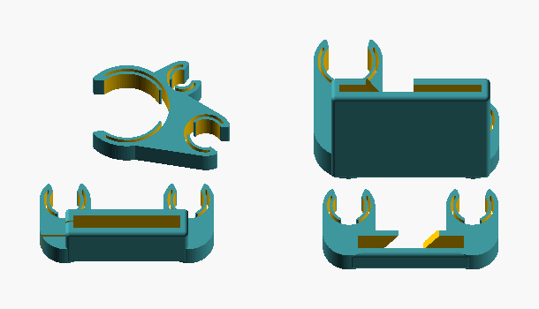
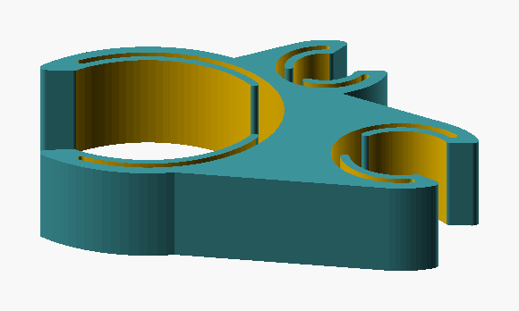
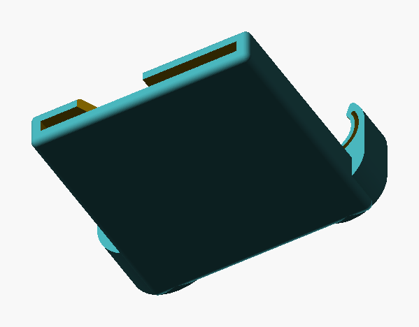
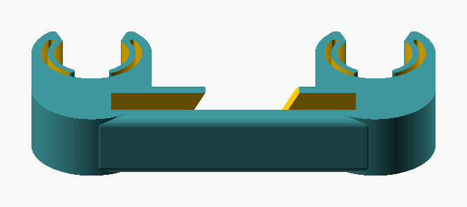
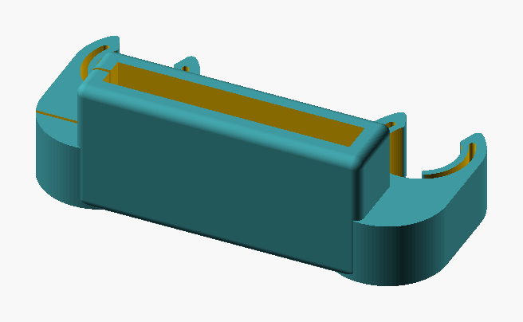

# scuba-clips

Parametric OpenSCAD clips for organising scuba hose: an inflator/SPG combo clip,
upper and lower octopus clips for webbing, and a webbing side clip with two
standoffs.



| Combo | Upper | Lower | Webbing |
| --- | --- | --- | --- |
|  |  |  |  |

## Use the nightly build, with the manifold solver

Use a **nightly** OpenSCAD and always pass `--backend=manifold`. The 2021.01 release
has no `--backend` option, so it cannot use manifold, and the legacy CGAL solver is
painful: on the same file, manifold renders the upper clip in **1.0 s** where CGAL
takes **3 min 04 s**. `make` refuses pre-2024 builds.

## Build

```sh
make            # list targets
make all        # STL + screenshot per model
make stl        # STLs only
make png        # screenshots only
make preview    # fast draft render (MODEL_FN=36)
make verify     # check volume, bbox, mesh vs tools/baseline
make clean
```

Or render a single model directly, or with another binary:

```sh
make OPENSCAD=/path/to/OpenSCAD stl
/Applications/OpenSCAD.app/Contents/MacOS/OpenSCAD \
  --backend=manifold --render=true -o build/upper.stl \
  models/upper_octi_retaining_clip.scad
```

## Layout

`models/` one part per file, `all.scad` the full plate · `lib/` reusable geometry ·
`dev/print_tests.scad` fit coupons, print these first · `docs/ARCHITECTURE.md`
conventions · `tools/` regression harness.

## Tuning

Knobs sit at the top of each model file:

| Model | Knobs |
| --- | --- |
| `inflator_spg_combo_clip` | `t_inner`, `t_outer`, `w_gap`, `clip_h`, its three hose diameters, and the outer clips' placement |
| `webbing_side_clip`, `all` | `wall_t`, `clip_h`, `gap`, `tube_d` |
| the two octi clips | none — sizes come from `lib/params.scad` |

Hose and webbing sizes live in `lib/params.scad` as `hose_*_dia()` and
`webbing_*_size()`. In the webbing clip, `wall_t` drives the block wall and the
walls of its clips.
