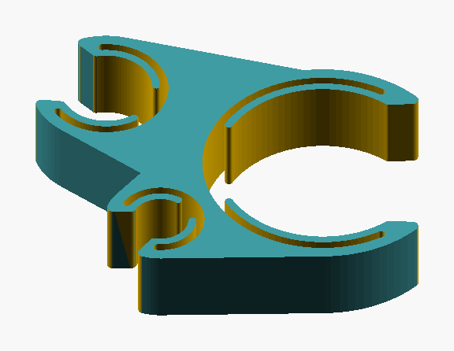
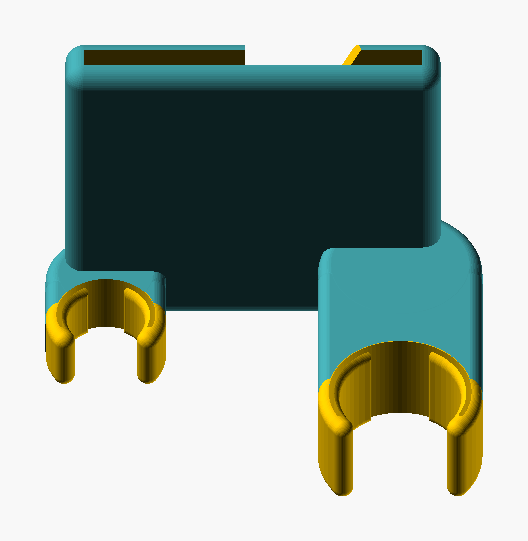
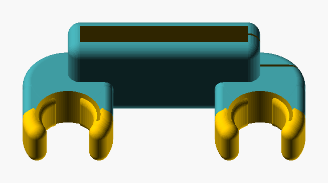
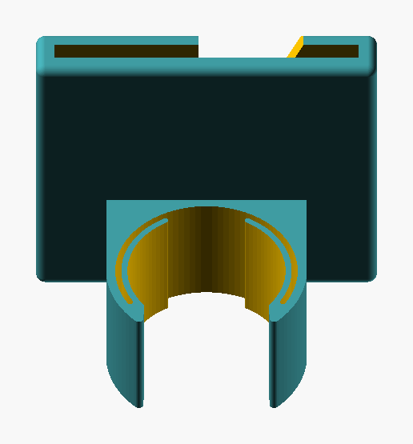

# Scuba Clips 🤿

[](https://scuba-clips.vercel.app/)
[](https://makerworld.com/en/models/3359585-v-s-scuba-clips-v1#profileId-3819649)

Parametric (customizable) clips for scuba gear. The default parameters are for my personal kit: an [OMS Lite CB Wing BCD](https://omsdirect.com/Lite-XS-Performance-Mono-27-lbs-12.5-kg-Black/S11518023) and the [Ocea XL4 regulators](https://www.apeksdiving.com/en-us/product/xl4-ocea-stage-3-dive-regulator-octopus-726024?color=6225).

## So... what does this project generate exactly?

### Inflator Tube + SPG + LPI hose clip
I'm tiny so I can comfortably view the side of my BCD Inflator controls, so I thought "why not combine them and be more streamlined?" and that's how this whole project started 😅 This clip routes the three hoses on my left together so my SPG is on the inner "flat" face of my inflator, and currently then hair elastic'd to the side (I'll make another custom print to replace that as well soon.)

||
|-|
||

### Octi/Alternate clips
I just didn't like how either dangly or inaccessible all the ways I had been shown to store my alternate were (I only dive back-mount singles currently, and yes since designing these I have been told about long lose and intend to try it out soon 💖)

|Upper|Lower|
|-|-|
|||

### Inflator tube clip
Is this overkill to replace the velcro? Maybe, but I didn't like it, so I replaced it 🤷‍♀️ It also prevents the slippage where I feel like I always have to yank the inflator forward before descending in the velcro since it slipped back.

||
|-|
||


## So... how do I build the models myself? 🤩

### Prerequisites 🔧

* OpenSCAD 2024 or newer (nightly): <https://openscad.org/downloads.html>.
* uv: <https://docs.astral.sh/uv/getting-started/installation/>.

> ⚠️ *I've only tested this on MacOS, feel free to make a PR to fix any issues you run into 💖*

### Configuration ⚙️

Copy `config.example.toml` to `config.toml` and update the measurements to match your own kit's spacing, diameters and webbing configuration.

### Generate the clips ✨

```sh
uv run cli make-all # Makes everything once
# or
uv run cli watch # Watches for file changes and rebuilds
```

Once that completes you should have a bunch of files in the `build/` folder. Grab the STLs and print away! I recommend PETG + 100% infill from my testing 💖

### Troubleshooting 😭

If the generator cannot find OpenSCAD give the full path to the program:

```sh
OPENSCAD=/path/to/OpenSCAD/binary uv run cli make-all
```

## License 📜

Copyright (C) 2026 Evelyne.

This project is licensed under the [Creative Commons Attribution-NonCommercial-ShareAlike 4.0 International License](LICENSE). You may share and adapt the files, but not for commercial use, and you must give credit and share your changes under the same license.

The author keeps all rights, including the right to sell prints and files. If you want a commercial license, contact the author.
